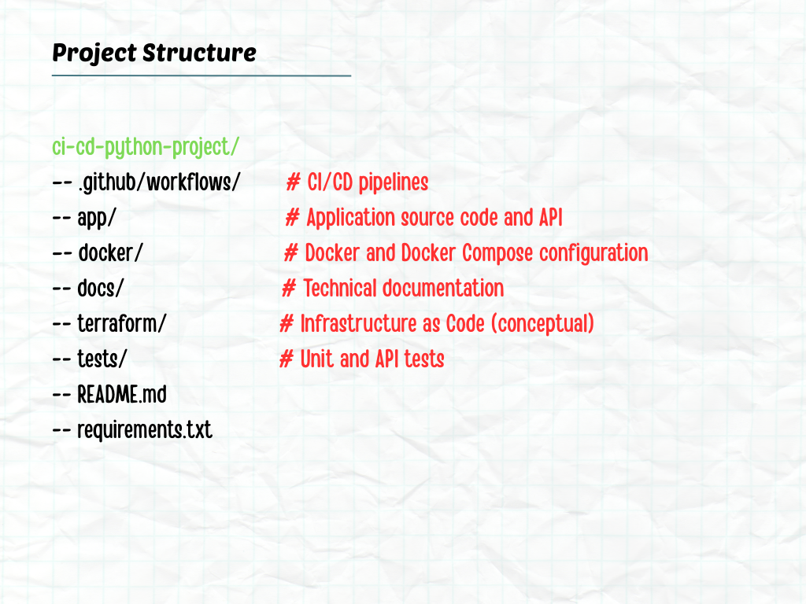
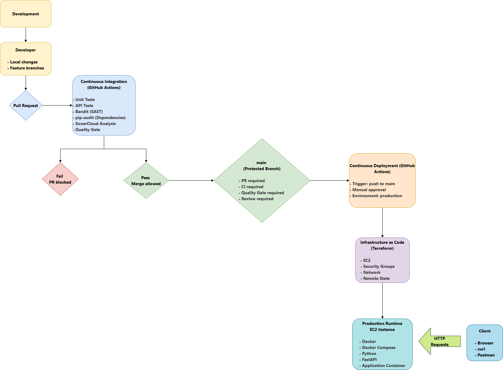

# CI/CD Python Project – Docker‑First DevSecOps Pipeline

## Project Overview

This project demonstrates a complete CI/CD pipeline for a Python application
using a Docker‑first and DevSecOps approach.

The primary focus of the project is not application complexity, but the design
and implementation of a professional software delivery pipeline that integrates
testing, quality analysis, security checks, Infrastructure as Code concepts,
and work management.

---

## Project Goals

- Build a Docker‑first CI/CD pipeline
- Execute unit and API tests automatically
- Generate and enforce code coverage via Quality Gates
- Enforce code quality using SonarQube
- Integrate security checks into the pipeline
- Demonstrate Infrastructure as Code using Terraform (local and controlled)
- A simple feature-branch workflow for team-based development in real environments.
- Simulate a real team workflow using GitHub Projects

---

## Application Functionality

The application contains intentionally simple, deterministic logic to serve
as a stable base for CI/CD and quality practices.

It includes three Python components:

1. **Dictionary**  
   Stores and retrieves word definitions.

2. **Cost Calculator**  
   Calculates the total cost of items including tax and ignores missing items.

3. **Word Builder**  
   Builds a word by taking indexed characters from a list of words.

All functionality is covered by automated tests.

---

## Project Structure

---

 ## Docker‑First Approach

All stages of the project run inside Docker containers:

- Development
- Testing
- CI/CD execution
- Security analysis
- Infrastructure definition

This guarantees consistent behavior across environments and eliminates
local dependency issues. The same runtime is used locally and in CI.

---

## CI/CD Pipeline

The CI/CD pipeline automates the following stages:

Build and Test

- Docker image build
- Automatic execution of unit and API tests

Code Quality

- Coverage generation using pytest‑cov
- SonarQube analysis
- Quality Gate enforcement

Security (DevSecOps)

- Bandit for Python static analysis
- pip‑audit for dependency vulnerability scanning

Infrastructure

- Terraform configuration review (no real resources provisioned)

Detailed pipeline documentation is available in the /docs directory.

---

---

## Code Quality and Coverage

- Tests are implemented using pytest
- Coverage is generated using pytest‑cov
- Coverage reports are imported into SonarQube
- A Quality Gate enforces minimum quality and coverage thresholds

---

## Security

Security checks are integrated directly into the CI pipeline:

- Bandit performs static code analysis
- pip‑audit checks dependencies for known vulnerabilities

The project demonstrates a shift‑left security approach without introducing
runtime or platform‑level security complexity.

---

## Infrastructure as Code (Terraform)

Terraform is included to demonstrate Infrastructure as Code concepts.

The configuration is intentionally minimal and does not provision
real cloud resources. Its purpose is to illustrate how infrastructure
definitions can live alongside application and CI/CD code.

Further details are available in terraform/README.md.

---

## Work Management

Project work is tracked using GitHub Projects to simulate a real team workflow.
The board includes:

- Backlog
- To Do
- In Progress
- Code Review
- Done

Issues represent tasks and real problems encountered during development.